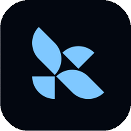
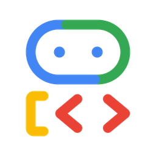

<picture>
  <source media="(prefers-color-scheme: dark)"  srcset="assets/hero-dark.svg" />
  <source media="(prefers-color-scheme: light)" srcset="assets/hero-light.svg" />
  
</picture>

## What I am building

- **[chaoslab](https://github.com/AviroopPaul/chaoslab)** · put a system on a whiteboard, crank it to 500M users, watch queueing math decide what melts
- **[snipbar](https://github.com/AviroopPaul/snipbar)** · select text on any site and get a tiny bar under it: copy, search, or ask
- **[agentconf](https://github.com/AviroopPaul/agentconf)** · read-only UI over `~/.claude`, `~/.codex`, `~/.cursor` and friends
- **[WhisprCatch](https://github.com/AviroopPaul/WhisprCatch)** · hold a key, speak, release, punctuated text at your cursor, fully on-device

## Stack

<!--
  The spacer images are load bearing. GitHub styles every table as
  `display:block; width:max-content`, so a width="100%" attribute is ignored and
  the table shrinks to its contents. A fixed-width transparent pixel in each
  header cell is what makes the four columns span the README instead.
-->
<table width="100%">
<thead>
<tr>
<th width="25%" align="center">Backend </th>
<th width="25%" align="center">Frontend </th>
<th width="25%" align="center">Agents </th>
<th width="25%" align="center">Infra </th>
</tr>
</thead>
<tbody>
<tr>
<td align="center">&nbsp;&nbsp;</td>
<td align="center">&nbsp;&nbsp;</td>
<td align="center">&nbsp;</td>
<td align="center">&nbsp;</td>
</tr>
</tbody>
</table>

## A year of commits

  <picture>
    <source media="(prefers-color-scheme: dark)"  srcset="https://raw.githubusercontent.com/AviroopPaul/AviroopPaul/output/snake-dark.svg" />
    <source media="(prefers-color-scheme: light)" srcset="https://raw.githubusercontent.com/AviroopPaul/AviroopPaul/output/snake.svg" />
    
  </picture>

<!--
  assets/hero-light.svg and assets/hero-dark.svg are self-contained: the Memoji
  and the subset mono face are inlined, because an SVG served through GitHub's
  image proxy is sandboxed and cannot fetch anything external. The typewriter
  runs inside the hero, so there is no second animated image on the page.

  The snake comes from .github/workflows/snake.yml (Platane/snk), which renders
  the real contribution grid to the "output" branch in the ledger palette.
-->
